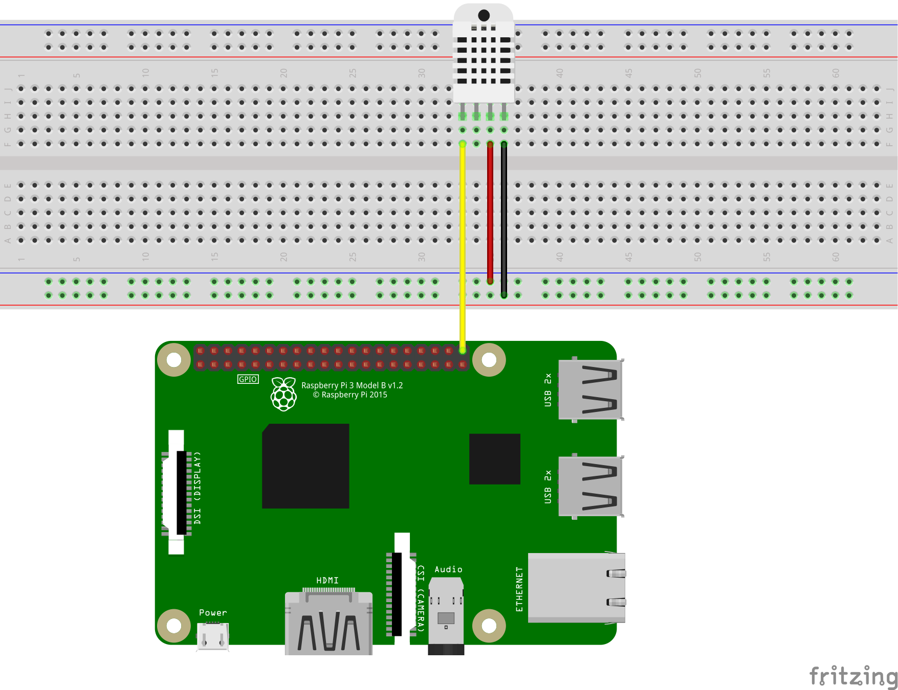

# Web App for Displaying Sensor data
* Web app is Available on here >>> [link](http://lsbu-sensors.herokuapp.com/)

# Exposed APIs
## Endpoint for realtime-date
* This returns a json data
* `/get-data` 

## Endpoint to obtain data from database
* This returns a json data
* `/sensor-data/<int:length>`

## Endpoint to get csv data
* This returns a csv
* `/sensor-data/csv/<int:length>`

## Endpoint to return statistics of data collected
* This returns a json data
* `/describe` 

## Raspberry Pi Sensor Setup

### DHT11 Circuit diagram



### DHT11 Agent script
```python
import RPi.GPIO as GPIO
import dht11
import time
import requests
import json

# initialize GPIO
GPIO.cleanup()
GPIO.setwarnings(False)
GPIO.setmode(GPIO.BCM)

# read data using Pin GPIO21
instance = dht11.DHT11(pin=21)


# url endpoint to send sensor data
url = 'https://lsbu-sensors.herokuapp.com/send'


def send_data(payload):
    r = requests.get(url, params=payload)
    data = json.loads(r.content.decode("utf-8"))
    print(data)


def get_data():
    result = instance.read()
    if result.is_valid():
        print("Temp: %d C" % result.temperature +' '+"Humid: %d %%" % result.humidity)
        payload = {'temperature': result.temperature, 'humidity': result.humidity}
        try:
            send_data(payload)
        except Exception as e:
            print('Error', e)


if __name__ == '__main__':
    while True:
        '''
        reads and sends sensor data to web page every 1 second
        '''
        get_data()
        time.sleep(1)
```